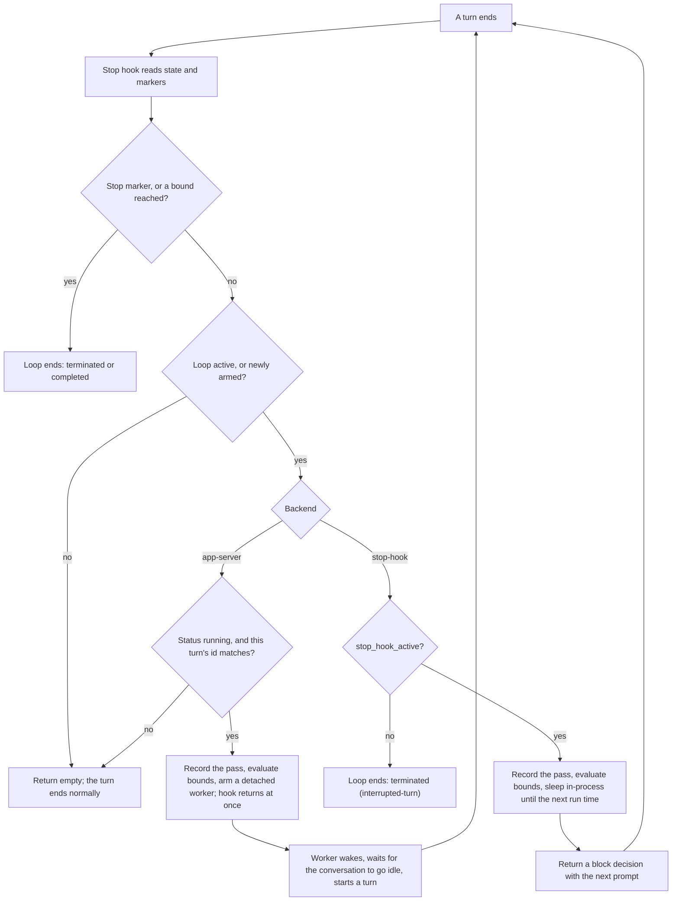
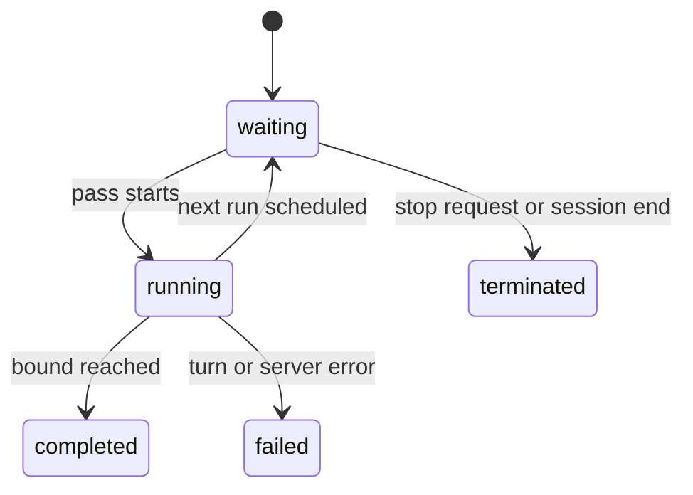

# codex-loop: Two Ways to Keep One Conversation Working

## What it is

`codex-loop` is a Codex plugin that repeats a prompt on a schedule inside the conversation you are already in. You start a loop by asking for one — "every 5 minutes, check the deploy" — or by giving just a task, in which case the model paces itself. A loop ends at a bound (a run count, a lifetime, a satisfied condition), when you stop it, or when the session ends.

The point is repetition that keeps its context: `crontab` cold-starts with no memory, a shell loop opens a new session each pass, and a daemon leaves a resident process behind.

## Why build this

The motivation for `codex-loop` grew out of clear frustrations with existing alternatives:

- **No ergonomic loop in the official Codex TUI**: Heavy terminal users of the Codex CLI/TUI have had no native, out-of-the-box mechanism to schedule repeated passes.
- **Official GUI loops create new threads incessantly, polluting session history**: While the official Codex GUI offers a loop task feature, its design spins up a **brand-new conversation for every single pass**. A recurring check running over a few days floods the sidebar with dozens or hundreds of fragmented throwaway threads, thoroughly scrambling your session history. A scheduled loop should stay neatly contained inside its own dedicated conversation, rather than cluttering your workspace with disposable threads.
- **Claude Code's 7-day ceiling and cloud bias**: Claude Code provides a built-in `/loop` via its cron engine, but it enforces a strict **7-day auto-expiration** on recurring jobs, tearing down the task after a week. To survive beyond that window, official guidance pushes tasks toward cloud runners (like Cloud Routines). But for many engineering tasks, you don't want or need your loops running in someone else's cloud with separate clones and credentials; you want them strictly local, bound to your current working tree, free from arbitrary lifespans.

**Why this indefinite single-conversation loop actually works in Codex**

Running dozens or hundreds of automated iterations inside one conversation is usually a recipe for context bloat, sluggishness, or memory breakdown. 

`codex-loop` is viable precisely because **Codex's long-running task handling and context compaction are remarkably seamless and robust**. As turns accumulate, Codex handles background compaction quietly and intelligently without user-facing friction or degraded coherence. That invisible, high-fidelity compression makes anchoring an open-ended loop directly within a single conversation not just a clever trick, but a clean, durable, and practical reality.

## The core idea

**The loop lives inside the conversation.** Every pass is an ordinary turn in the same conversation, same working directory, same history — no task queue, and no second session doing the real work while you watch.

**The Stop hook is the whole mechanism.** Codex calls the plugin's Stop hook when a turn ends and honors what it returns: empty lets the turn end; `block` sends the conversation back around with a new prompt. That one lever drives every continuation.

**The model proposes, the runtime decides.** The model cannot call the runtime; it emits HTML comments in its final message — *markers*, invisible in rendered output — to arm a loop (register it as pending, so the next turn end picks it up), stop it, signal completion, or request a delay. A marker carries only a loop ID: the configuration travels out of band, as a one-shot file the hook consumes and deletes, so a marker can never arm two loops. Requested delays are clamped to 1 minute–1 hour, and completion signals are ignored on `--until-stopped` loops.

**Loops are scoped to a session.** One state file per session, and the plugin reads no one else's — a loop in another Codex window is invisible to this one.

Two consequences. A *durable goal* — Codex's other way of making a turn continue itself — cannot be created while a loop is armed; both want to own the turn end, and only one can. And `--every 5m` snaps to a clean cron cadence, so passes tick on wall-clock boundaries instead of drifting.

## The two modes

Both implement "wait, then feed the conversation its next prompt." The plugin picks by probing for a Codex App Server at start — a capability check, not a flag.

| | App Server (`app-server`) | Synchronous (`stop-hook`) |
| --- | --- | --- |
| How it waits | a detached worker sleeps outside the session | the hook sleeps in-process |
| Your terminal | stays free | occupied for the whole wait |
| How you stop it | just type; the assistant emits a stop marker | `Ctrl-C` |
| Longest wait | bounded only by session and server | just under 7 days, the hook's timeout |
| When you get it | session attached to an App Server | everywhere else — the fallback |

### App Server mode

The waiting happens in a detached worker that owns exactly one pass. It sleeps in chunks of at most 60 seconds and re-reads the state file between them, so a loop you stop mid-wait is noticed within a minute and the worker exits on its own. When the pass is due it waits for the conversation to go idle, then starts the turn — which ends in your terminal, so the hook fires again and arms the next worker.

One setup detail bites. The hook is a child of the App Server, so `CODEX_LOOP_APP_SERVER_SOCKET` must be exported *before* `codex app-server --listen` starts — otherwise the plugin silently falls back. The README's `loopcodex` launcher gets the ordering right.

**The principle:** nothing is ever told to stop — the state file is the only authority, and the worker asks it.

### Synchronous mode

One process, one long sleep, one decision per pass. The failure modes are correspondingly simple, and that is the honest trade: `Ctrl-C` aborts the sleep and marks the loop interrupted, and a turn the hook did not itself trigger ends the loop rather than getting scheduled on. Waits past that ceiling are refused up front rather than failing seven days later, with a pointer to `loopcodex`.

**The principle:** degrade to something that always works. This mode needs nothing but the Stop hook contract, so a loop runs even on a CLI with no App Server support.

## How a pass flows

Every pass runs the same decision, whichever mode is active:

### What a loop can be doing

Every loop sits in one of five states; only `failed` and `terminated` are unplanned exits.

## Edge cases and limits

Two failures get special treatment instead of killing the loop:

- **Usage limits and HTTP 429.** If a pass fails because the account hit a usage limit or got throttled, that attempt is not counted. The loop stays `waiting` and retries — at the reset time reported in the error when there is one, otherwise on backoff between 5 minutes and 6 hours.
- **Lost server connection.** If the worker loses its App Server connection while watching a turn — a timeout or a dropped socket — it does not fail the loop. It marks the runtime as recovering and reconnects on short backoff (1–60 seconds), picking its watch back up once the server answers.

The hard limits are what remain: loops do not outlive the session, do not tick below one-minute resolution, and do not backfill missed passes. The machine, the session, and — in App Server mode — the server must stay running.