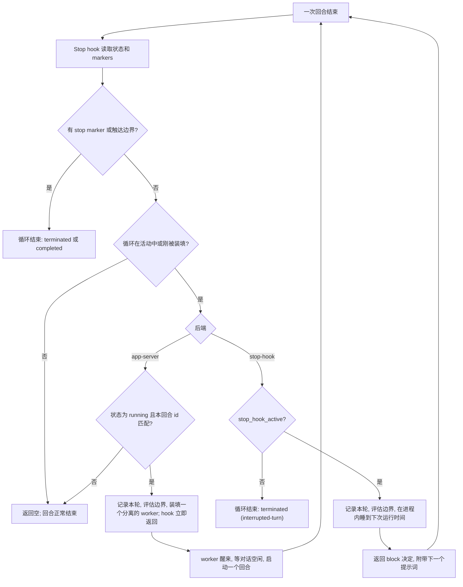
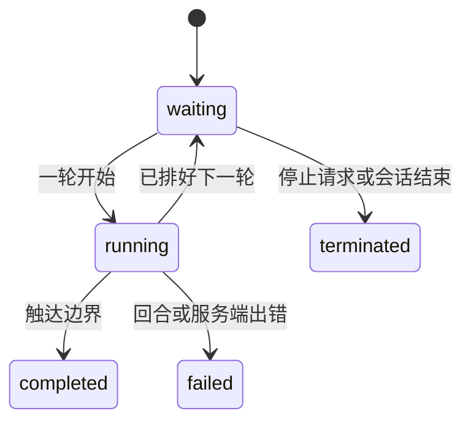

# codex-loop：让同一段对话持续工作的两种方式

## 这是什么

`codex-loop` 是一个 Codex 插件，它会在你当前所在的这段对话里，按计划反复执行同一个提示词。你可以直接开口要一个循环——比如「每 5 分钟检查一次部署」——也可以只丢给它一个任务，让模型自己把握节奏。循环会在触达某个边界（跑够次数、到达存活时长、满足某个条件）时结束，也会在你手动停止或会话结束时结束。

它的价值在于「带着上下文的重复」：`crontab` 每次都是冷启动，没有记忆；shell 循环每跑一轮就开一个新会话；守护进程则会留下一个常驻进程。

## 为什么做它

做 `codex-loop` 的最初发心，源自日常高频使用中几个现有方案的真实痛点：

- **Codex 官方 TUI 缺乏好用的 Loop 能力**：日常在终端里重度使用 Codex CLI/TUI 时，官方并没有提供一套顺手、开箱即用的本地循环交互。
- **官方 GUI Loop 频繁新建会话，严重污染会话列表**：Codex 官方在图形化界面（GUI）中虽然提供了 Loop 任务能力，但它的机制是**每一轮迭代都新建一个独立的会话（Conversation）**。定时任务跑上一天，侧边栏的历史记录里就会堆满几十上百个碎片会话，彻底打乱原有的会话管理。一个循环任务理应收敛在一条专属的对话流里安静推进，而不是在列表里疯狂制造噪音。
- **Claude Code Loop 的「7 天紧箍咒」与云端导向**：Claude Code 虽内置了 `/loop`，但它在机制上给所有周期任务强行加上了 **7 天自动过期（Seven-day expiry）** 的硬上限，时间一到就强制销毁。如果想要突破这个周期限制做持久调度，官方指引的路径往往是推向云端（如 Cloud Routines）。但很多场景下我们压根不希望把任务丢到云端跑，而是希望它老老实实驻留在本地机器、受本地环境掌控、且没有倒计时紧箍咒。

**为什么这种「无限轮次长跑」在 Codex 体系下能够真正成立？**

在单段对话里跑几十上百轮循环，最怕的是上下文无限膨胀导致模型卡顿、失忆或崩溃。这个工具之所以能稳稳跑起来，根本底气在于 **Codex 本身的长程任务处理与上下文无感压缩能力极其出色**。

在会话不断拉长的过程中，Codex 底层的上下文压缩（Compaction）过程极其平滑且无感，能在悄无声息中消化巨量历史、稳稳守住关键上下文。正是这种底层的压缩素质，让「把无限循环直接做进同一段对话」从一个看似危险的想法，变成了一种优雅、干净且极其可靠的工程实践。

## 核心思路

**循环就活在对话里。** 每一轮都是同一段对话中的一次普通回合，工作目录一样，历史记录一样——没有任务队列，也不会另开一个会话在后面干活、让你在旁边看着。

**整个机制就是 Stop hook。** 一次回合结束时，Codex 会调用插件的 Stop hook，并按它的返回值行事：返回空，回合就正常结束；返回 `block`，就带着一个新提示词让对话再转一圈。所有的「继续」都由这一个开关驱动。

**模型提议，运行时决定。** 模型没法调用运行时；它只能在最终回复里输出 HTML 注释——也就是 *markers*，在渲染结果里看不见——用来装填一个循环（把它登记为待生效，下次回合结束时就会被接手）、停止循环、发出完成信号，或者请求一段延迟。一个 marker 只带一个循环 ID：配置走的是带外通道，是一个一次性文件，hook 读完就删，所以同一个 marker 永远不可能装填出两个循环。请求的延迟会被限制在 1 分钟到 1 小时之间；对 `--until-stopped` 循环，完成信号会被忽略。

**循环的作用域是会话。** 每个会话一份状态文件，插件也只读自己这一份，绝不去读其他会话的状态文件——另一个 Codex 窗口里的循环，在这边完全看不见。

由此带来两个结果。其一，*durable goal*——Codex 让回合自我延续的另一种方式——在循环已装填时无法创建；两者都想接管回合结束，而只能有一个说了算。其二，`--every 5m` 会对齐到规整的 cron 节奏，所以每一轮都踩在时钟的整分刻度上（:00、:05、:10…），不会越跑越偏。

## 两种模式

两种模式做的是同一件事：「先等待，再把下一个提示词喂给对话」。插件在启动时探测有没有 Codex App Server，据此挑一种——这是能力检测，不是让你手动指定的命令行参数。

| | App Server（`app-server`） | 同步（`stop-hook`） |
| --- | --- | --- |
| 怎么等 | 一个分离出去的 worker 在会话之外睡觉 | hook 在进程内睡觉 |
| 你的终端 | 一直空着可用 | 整个等待期间都被占住 |
| 怎么停 | 直接打字，助手会输出一个 stop marker | `Ctrl-C` |
| 最长能等多久 | 只受会话和服务端限制 | 略少于 7 天，也就是 hook 的超时上限 |
| 什么时候会用到 | 会话接到了 App Server 上 | 其他所有情况——兜底方案 |

### App Server 模式

等待发生在一个分离出去的 worker 里，它只负责一轮。它按每段最多 60 秒分片睡眠，每两段之间重新读一次状态文件；所以你在等待途中停掉循环，一分钟内就会被发现，worker 会自己退出。等这一轮到点，它会先等对话空闲下来，再启动这个回合——回合在你的终端里结束，于是 hook 再次触发，装填下一个 worker。

有一个配置细节容易踩坑。hook 是 App Server 的子进程，所以 `CODEX_LOOP_APP_SERVER_SOCKET` 必须在 `codex app-server --listen` 启动*之前*就导出——否则插件会悄悄退回同步模式。README 里的 `loopcodex` 启动脚本把顺序处理对了。

**原则：** 从不去通知谁停下——状态文件是唯一的权威，worker 自己去问它。

### 同步模式

一个进程，一次长睡眠，每轮一个决定。出问题的方式也相应地简单——这笔账它摆在明面上：`Ctrl-C` 会打断睡眠，并把循环标记为中断；不是 hook 自己触发的回合，会直接让循环结束，而不是接着排下一轮。超过上限的等待会在一开始就被拒绝，而不是等七天之后才失败，同时会提示你去用 `loopcodex`。

**原则：** 降级到一个总能用的东西。这个模式只依赖 Stop hook 这一份契约，所以哪怕 CLI 不支持 App Server，循环照样能跑。

## 一轮是怎么走完的

不管当前是哪种模式，每一轮走的都是同一套判断：

### 一个循环可能处在什么状态

每个循环都处于五种状态之一；只有 `failed` 和 `terminated` 是计划外的退出。

## 边缘情况与限制

有两类失败不会杀死循环，而是被特殊对待：

- **额度耗尽与 HTTP 429 限流。** 某一轮因为额度用尽或被限流而失败时，这一轮不计数。循环保持 `waiting` 并自动重试——错误里给出了额度重置时间就等到那个时间，否则按 5 分钟到 6 小时之间的退避重试。
- **与服务端断连。** worker 在盯守一个回合时与 App Server 断开——超时或 socket 掉线——不会把循环判死。它会把运行时标记为恢复中，按 1 到 60 秒的短退避重连，服务端一恢复应答就接着盯完这一轮。

剩下的才是硬性边界：循环不会活得比会话久，节拍不细于一分钟，错过的轮次不补跑。机器、会话，以及 App Server 模式下的服务端，必须保持运行。